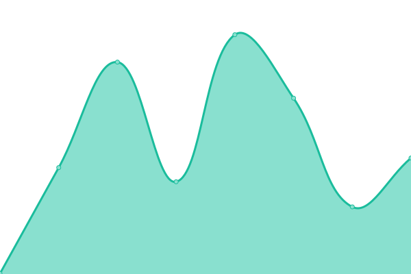
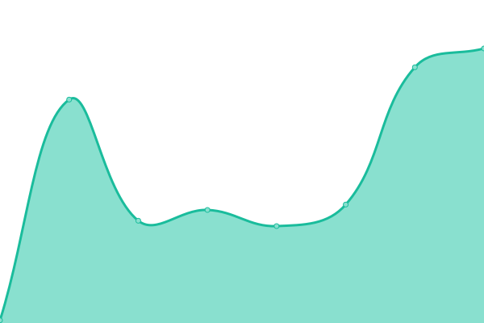
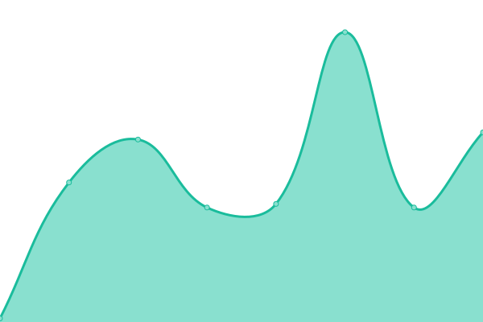
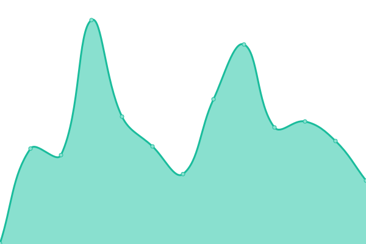
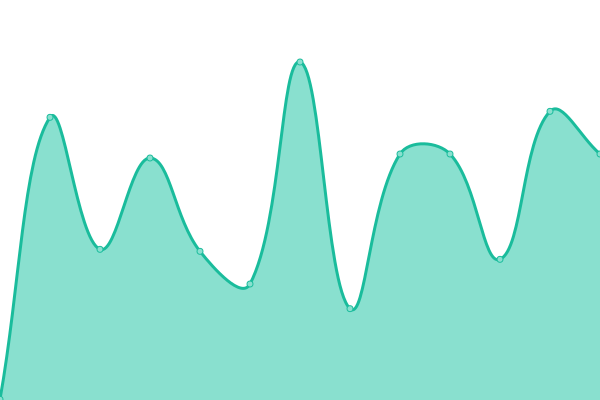

# [📈 Live Status](https://ricardoheil.github.io/test-uptime): <!--live status--> **🟧 Partial outage**

This repository contains the open-source uptime monitor and status page for [ricardoheil](https://ricardoheil.github.io/test-uptime), powered by [Upptime](https://github.com/upptime/upptime).

With [Upptime](https://upptime.js.org), you can get your own unlimited and free uptime monitor and status page, powered entirely by a GitHub repository. We use [Issues](https://github.com/ricardoheil/test-uptime/issues) as incident reports, [Actions](https://github.com/ricardoheil/test-uptime/actions) as uptime monitors, and [Pages](https://ricardoheil.github.io/test-uptime) for the status page.

<!--start: status pages-->
<!-- This summary is generated by Upptime (https://github.com/upptime/upptime) -->
<!-- Do not edit this manually, your changes will be overwritten -->
<!-- prettier-ignore -->
| URL | Status | History | Response Time | Uptime |
| --- | ------ | ------- | ------------- | ------ |
|  OPTA 1 | 🟥 Down | [opta-1.yml](https://github.com/ricardoheil/test-uptime/commits/HEAD/history/opta-1.yml) | 

 240ms
     
 | 

<a href="https://ricardoheil.github.io/test-uptime/history/opta-1">0.00%</a>
    

|  OPTA 2 | 🟥 Down | [opta-2.yml](https://github.com/ricardoheil/test-uptime/commits/HEAD/history/opta-2.yml) | 

 122ms
     
 | 

<a href="https://ricardoheil.github.io/test-uptime/history/opta-2">0.00%</a>
    

|  OPTA 3 | 🟥 Down | [opta-3.yml](https://github.com/ricardoheil/test-uptime/commits/HEAD/history/opta-3.yml) | 

 54ms
     
 | 

<a href="https://ricardoheil.github.io/test-uptime/history/opta-3">0.00%</a>
    

|  OPTA 4 | 🟥 Down | [opta-4.yml](https://github.com/ricardoheil/test-uptime/commits/HEAD/history/opta-4.yml) | 

 48ms
     
 | 

<a href="https://ricardoheil.github.io/test-uptime/history/opta-4">0.00%</a>
    

|  OPTA 5 | 🟥 Down | [opta-5.yml](https://github.com/ricardoheil/test-uptime/commits/HEAD/history/opta-5.yml) | 

 61ms
     
 | 

<a href="https://ricardoheil.github.io/test-uptime/history/opta-5">0.00%</a>
    

|  OPTA 6 | 🟥 Down | [opta-6.yml](https://github.com/ricardoheil/test-uptime/commits/HEAD/history/opta-6.yml) | 

 47ms
     
 | 

<a href="https://ricardoheil.github.io/test-uptime/history/opta-6">0.00%</a>
    

|  OPTA 7 | 🟥 Down | [opta-7.yml](https://github.com/ricardoheil/test-uptime/commits/HEAD/history/opta-7.yml) | 

 55ms
     
 | 

<a href="https://ricardoheil.github.io/test-uptime/history/opta-7">0.00%</a>
    

|  OPTA 8 | 🟥 Down | [opta-8.yml](https://github.com/ricardoheil/test-uptime/commits/HEAD/history/opta-8.yml) | 

 49ms
     
 | 

<a href="https://ricardoheil.github.io/test-uptime/history/opta-8">0.00%</a>
    

|  OPTA | 🟩 Up | [opta.yml](https://github.com/ricardoheil/test-uptime/commits/HEAD/history/opta.yml) | 

 38ms
     
 | 

<a href="https://ricardoheil.github.io/test-uptime/history/opta">100.00%</a>
    

|  FIR | 🟩 Up | [fir.yml](https://github.com/ricardoheil/test-uptime/commits/HEAD/history/fir.yml) | 

 220ms
     
 | 

<a href="https://ricardoheil.github.io/test-uptime/history/fir">100.00%</a>
    

|  FIR B. | 🟩 Up | [fir-b.yml](https://github.com/ricardoheil/test-uptime/commits/HEAD/history/fir-b.yml) | 

 2263ms
     
 | 

<a href="https://ricardoheil.github.io/test-uptime/history/fir-b">100.00%</a>
    

<!--end: status pages-->

[**Visit our status website →**](https://ricardoheil.github.io/test-uptime)

## 📄 License

- Powered by: [Upptime](https://github.com/upptime/upptime)
- Code: [MIT](./LICENSE) © [ricardoheil](https://ricardoheil.github.io/test-uptime)
- Data in the `./history` directory: [Open Database License](https://opendatacommons.org/licenses/odbl/1-0/)
